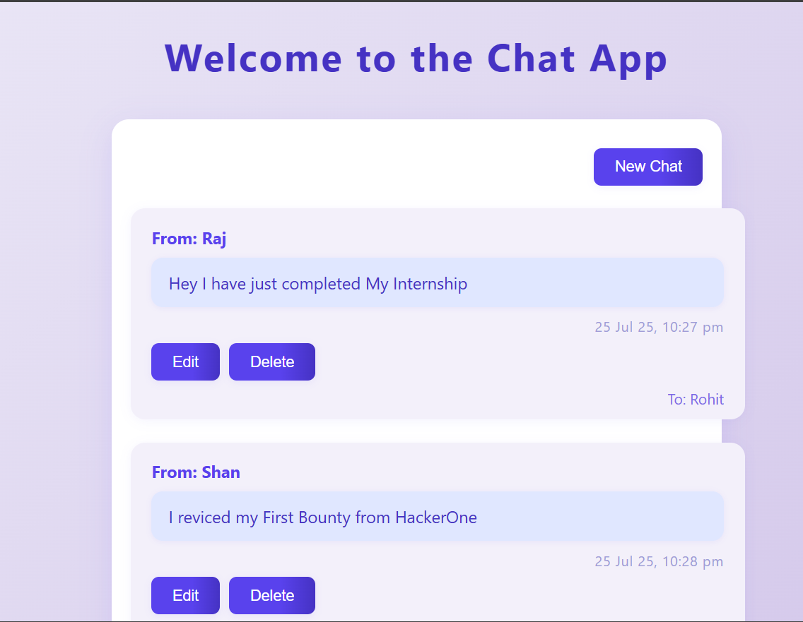
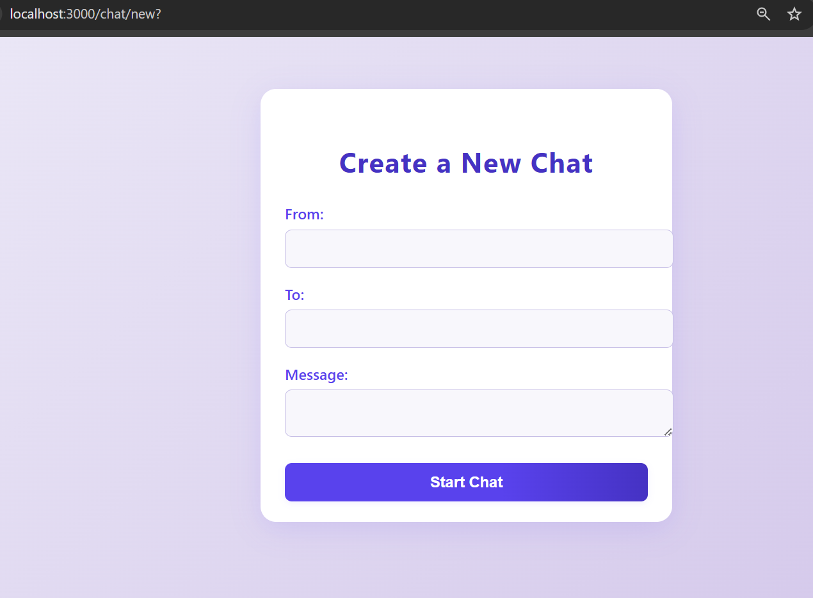
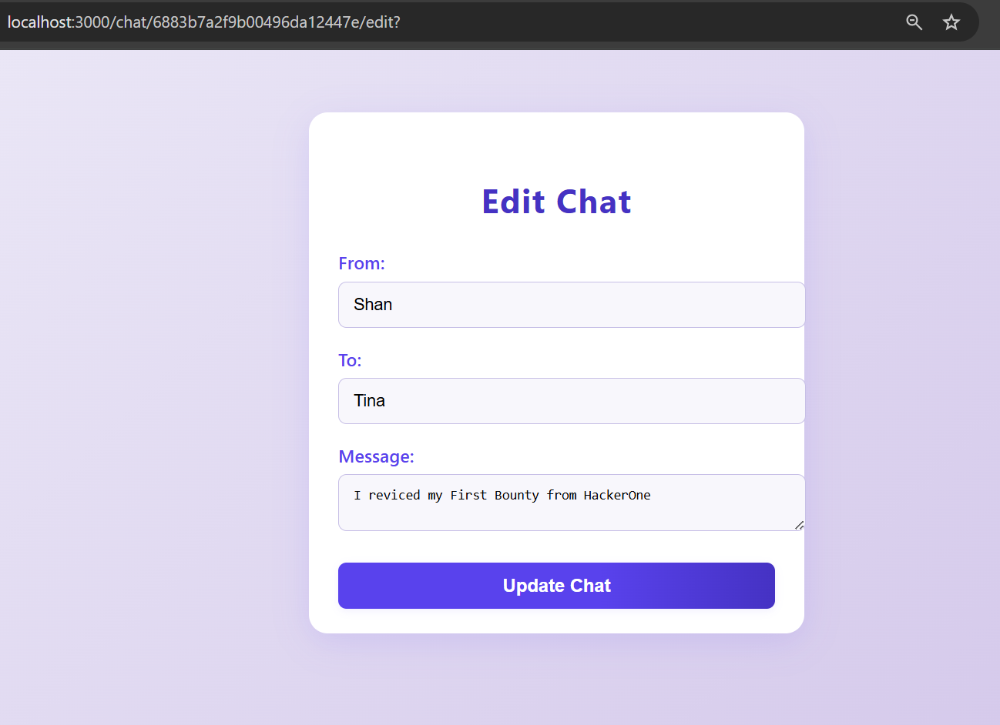

# Chat-App
A modern Node.js + Express chat app with MongoDB, EJS UI, and full CRUD features using RESTful routing.
# 📬 Node.js Chat App

A simple yet modern chat application built with **Node.js**, **Express**, and **MongoDB**. This app allows users to create, edit, and delete chat messages in a clean interface, using RESTful routes and EJS templates for a smooth user experience.

## ✨ Features

- 📝 Create, edit, and delete chat messages
- 📥 Each chat includes **sender**, **receiver**, **message**, and **timestamp**
- 🖼️ Modern, responsive UI with EJS and custom CSS
- 🗃️ Mongoose schema with auto-generated timestamps
- 🌐 RESTful API with method-override for PUT and DELETE
- 📁 Organized project structure with MVC pattern
- 🧩 Static assets served from the `public` directory

## 📸 Screenshots

- **Chat List Page**  
  

- **Create New Chat**  
  

- **Edit Chat**  
  

## 🚀 Getting Started Locally

Follow these steps to run the app on your local machine.

### 📦 Prerequisites

- [Node.js](https://nodejs.org/en/download/)
- [MongoDB](https://www.mongodb.com/try/download/community)

### ⚙️ Installation

1. **Clone the repository**  
   ```bash
   git clone https://github.com/your-username/chat-app.git
   cd chat-app

